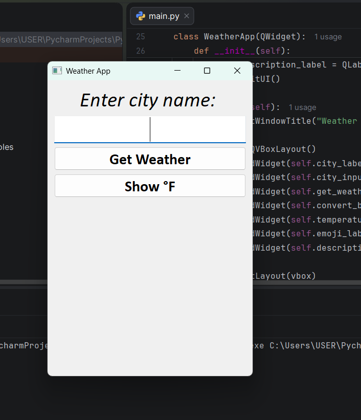
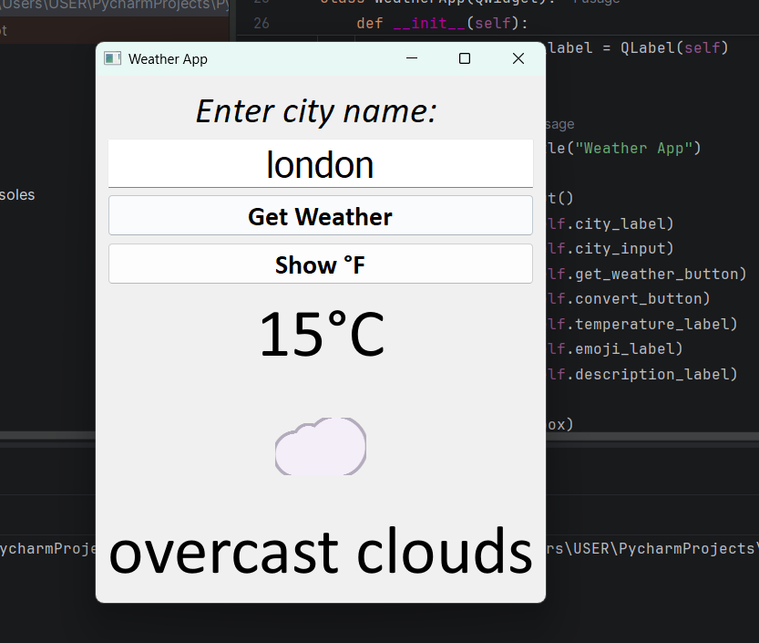
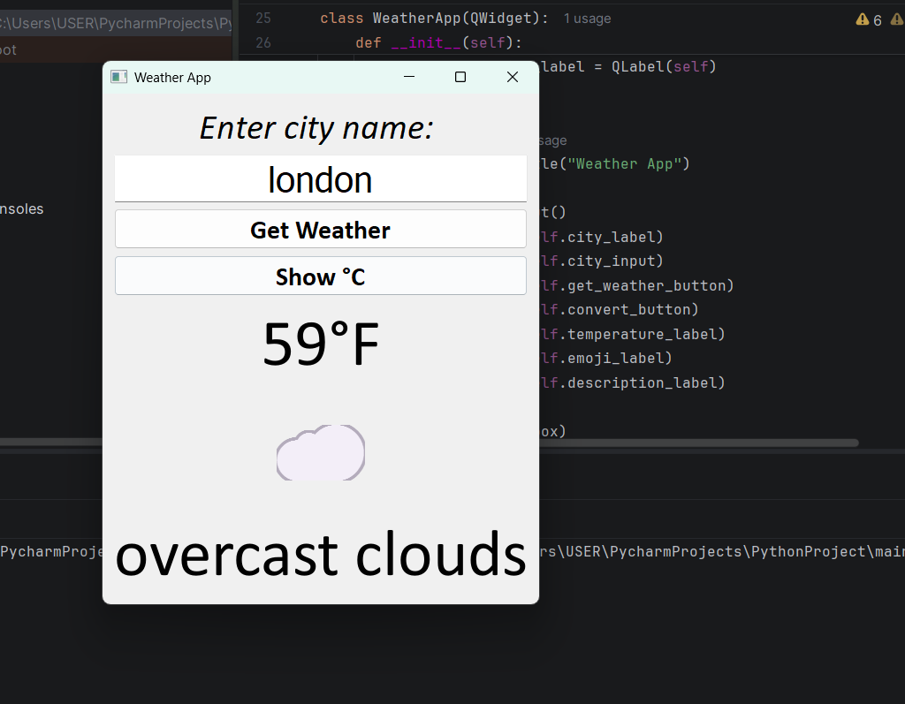
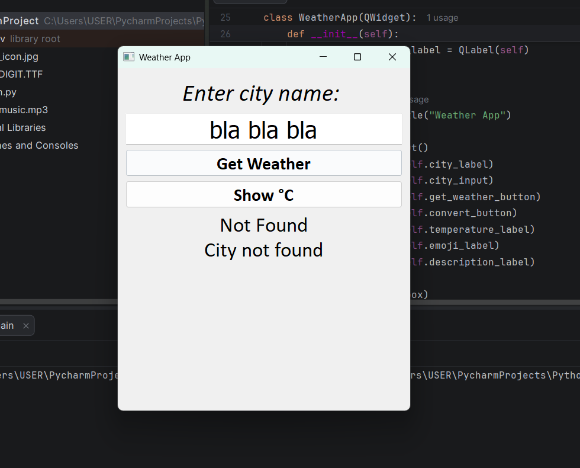

# Weather App (PyQt5)

A desktop weather application built with Python and PyQt5 that retrieves real-time weather information using the OpenWeatherMap API.

## Features

- Search weather by city name
- Displays current temperature
- Displays weather description
- Displays weather emoji based on weather conditions
- Convert temperature between Celsius and Fahrenheit
- Handles common API and network errors gracefully
- Simple and responsive graphical user interface

## Technologies Used

- Python
- PyQt5
- Requests
- OpenWeatherMap API

## Screenshots

### Main Application



### Weather Result



### Connverted Result



### Error Handling



## Installation

Clone the repository:

```bash
git clone https://github.com/yourusername/weather-app-pyqt5.git
```

Navigate into the project directory:

```bash
cd weather-app-pyqt5
```

Install dependencies:

```bash
pip install -r requirements.txt
```

Run the application:

```bash
python weather_app.py
```

## What I Learned

This project helped me practice:

- Object-Oriented Programming (OOP)
- GUI development with PyQt5
- Working with APIs
- Parsing JSON data
- Error handling using try/except
- Signals and slots in PyQt5
- Managing application state
- Building features beyond a tutorial

## Future Improvements

- Search history
- Save favorite cities
- Weather forecast support
- Temperature unit preferences
- Better application styling

## API Source

OpenWeatherMap API

https://openweathermap.org/api

Create a free OpenWeatherMap account and replace
YOUR_API_KEY with your own API key.
